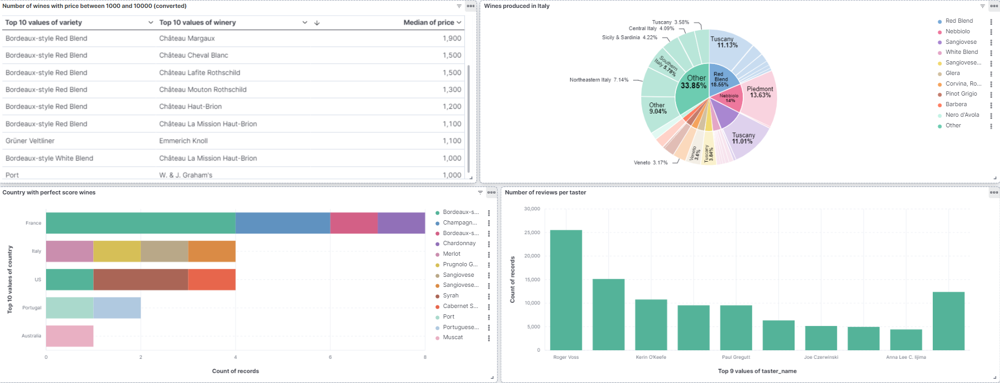
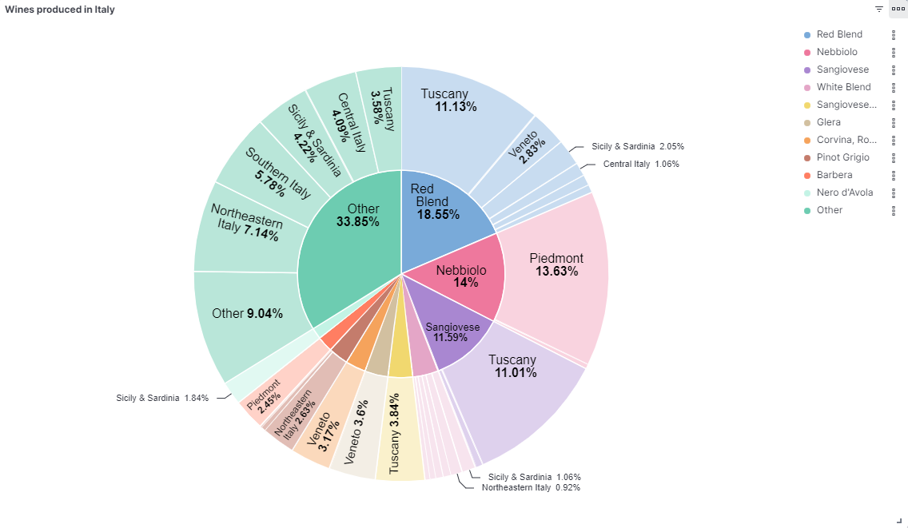

# Systems and Methods for Big and Unstructured Data: Project

## Authors
This Project was developed by:
- Francesco Di Giore [@Digioref](https://github.com/Digioref)
- Federico de Introna [@federicodeintrona](https://github.com/federicodeintrona)

## Introduction 
This is the repository for the Project of Systems and Methods for Big and Unstructured Data in the academic year 2023/2024 at Polytechnic of Milan.

Subject: 056901 - Systems and Methods for Big and Unstructured Data

Professor: Brambilla Marco

Academic Year: 2023/2024

## Description of the Project
The goal of this project is to analyze a dataset using a NoSQL database and perform some queries, highlighting the features of the data inside the dataset and how the NoSQL technology works.

For further details, please check the [full_specifications](SMBUD_Project-2023_2024.pdf).

### Dataset
The dataset chosen for the analyses is a dataset about wines, taken from winemag. For each wine, there are the title, the description, the review, the score.

The dataset is available at the link provided in the [dump file](dump/dump.txt).

### NoSQL Technology
<table>
  <tr>
    <td valign="top" align="center">
      
       
    </td>
    <td valign="top" align="center">
      
       
    </td>
  </tr>
</table>

The NoSQL technology used for this project is **ElasticSearch**. For the creation of the dashboards, **Kibana** has been used.

The dashboards created with Kibana are provided in the [Extras folder](Extras). Images of dashboards and queries are in the [Pictures folder](Pictures).

The queries and all the analyses are provided inside the [report file](SMBUD_Project-Report.pdf).

## Final Considerations
Final Mark: 2.5/2.0 (got 0.5 for the excellent work)

